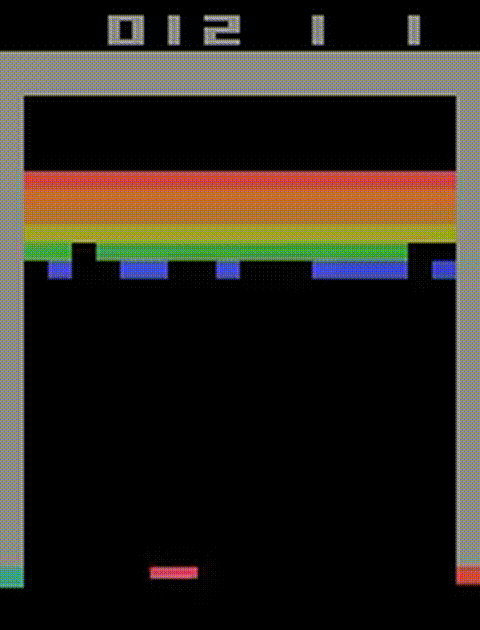
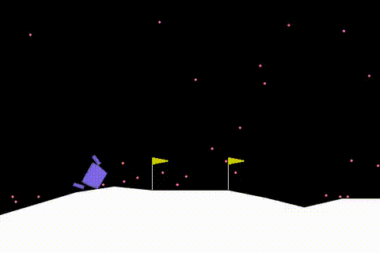
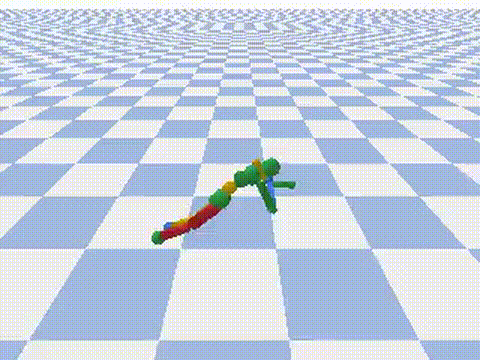

# Proximal Policy Optimization Algorithm

This project reproduces the **Proximal Policy Optimization (PPO)** algorithm from the original paper ["Proximal Policy Optimization Algorithms"](https://arxiv.org/abs/1707.06347) by Schulman et al. (2017) using PyTorch. The implementation features four specialized versions for different types of environments:

- **`ppo_descrete.py`**: Optimized for **classic control tasks** (CartPole, LunarLander) with MLP networks
- **`ppo_atari.py`**: Optimized for **Atari games** (Breakout, Pong) with CNN networks  
- **`ppo_continous.py`**: Optimized for **continuous control tasks** (MuJoCo environments like HalfCheetah, Ant, Humanoid) with MLP networks
- **`ppo_racing.py`**: Optimized for **CarRacing environments** with CNN networks for visual input

The code supports logging to TensorBoard and Weights & Biases (wandb) for experiment tracking and visualization.

## 🎮 Environment Showcase


<div align="center">

<table>
  <tr>
    <td align="center"><br>Breakout</td>
    <td align="center"><br>LunarLander</td>
    <td align="center"><br>CarRacing</td>
  </tr>
  <tr>
    <td align="center"><br>HalfCheetah</td>
    <td align="center"><br>Ant</td>
    <td align="center"><br>Humanoid</td>
  </tr>
</table>

</div>


## Table of Contents
- [Environment Showcase](#-environment-showcase)
- [Requirements](#requirements)
- [Installation](#installation)
- [Quick Start](#quick-start)
- [How to Run](#how-to-run)
  - [Discrete Action Spaces (ppo_descrete.py)](#discrete-action-spaces-ppo_descretepy)
  - [Atari Games (ppo_atari.py)](#atari-games-ppo_ataripy)
  - [Continuous Control (ppo_continous.py)](#continuous-control-ppo_continouspy)
  - [CarRacing (ppo_racing.py)](#carracing-ppo_racingpy)
  - [Test Utility (test_random_action.py)](#test-utility-test_random_actionpy)
- [Script Comparison](#script-comparison)
- [Arguments](#arguments)

## Requirements

- Python 3.8 or higher
- Conda (Miniconda or Anaconda)
- Dependencies are listed in `requirements.txt`.

## Installation

### Option 1: Using Conda (Recommended)

1. **Create a conda environment with Python 3.8:**
   ```bash
   conda create -n ppo-algorithm python=3.8
   conda activate ppo-algorithm
   ```

2. **Install box2d-py from conda-forge (avoids compilation issues):**
   ```bash
   conda install -c conda-forge box2d-py
   ```

3. **Install remaining dependencies:**
   ```bash
   pip install -r requirements.txt
   ```

### Option 2: Using pip only

If you prefer to use pip only, ensure you have the necessary build tools installed:

**For Ubuntu/Debian:**
```bash
sudo apt update
sudo apt install -y build-essential python3-dev swig
pip install -r requirements.txt
```

**For macOS:**
```bash
brew install swig
pip install -r requirements.txt
```

**Note:** The conda approach is recommended as it avoids compilation issues with `box2d-py` and provides pre-compiled binaries.

## Quick Start

1. **Activate the conda environment:**
   ```bash
   conda activate ppo-algorithm
   ```

2. **Choose your implementation:**

   **For Classic Control Tasks (CartPole, LunarLander):**
   ```bash
   python ppo_descrete.py --gym-id CartPole-v1 --track --wandb-project-name ppo-reproduction
   ```

   **For Atari Games (Breakout, Pong):**
   ```bash
   python ppo_atari.py --gym-id BreakoutNoFrameskip-v4 --track --wandb-project-name ppo-reproduction
   ```

## How to Run

1. **Activate the conda environment:**
   ```bash
   conda activate ppo-algorithm
   ```

2. **Choose the appropriate script and environment:**

### Discrete Action Spaces (ppo_descrete.py)

**Best for:** Classic control tasks with discrete action spaces (CartPole, LunarLander, Acrobot)

**CartPole-v1:**
```bash
python ppo_descrete.py --gym-id CartPole-v1 --total-timesteps 25000 --track --wandb-project-name ppo-reproduction
```

**LunarLander-v2:**
```bash
python ppo_descrete.py --gym-id LunarLander-v2 --total-timesteps 100000 --track --wandb-project-name ppo-reproduction
```

**Acrobot-v1:**
```bash
python ppo_descrete.py --gym-id Acrobot-v1 --total-timesteps 50000 --track --wandb-project-name ppo-reproduction
```

### Atari Games (ppo_atari.py)

**Best for:** Atari games with visual input requiring CNN processing

**Breakout:**
```bash
python ppo_atari.py --gym-id BreakoutNoFrameskip-v4 --total-timesteps 10000000 --track --wandb-project-name ppo-reproduction
```

**Pong:**
```bash
python ppo_atari.py --gym-id PongNoFrameskip-v4 --total-timesteps 10000000 --track --wandb-project-name ppo-reproduction
```

**SpaceInvaders:**
```bash
python ppo_atari.py --gym-id SpaceInvadersNoFrameskip-v4 --total-timesteps 10000000 --track --wandb-project-name ppo-reproduction
```

### Continuous Control (ppo_continous.py)

**Best for:** MuJoCo and PyBullet environments with continuous action spaces

**HalfCheetah:**
```bash
python ppo_continous.py --gym-id HalfCheetahBulletEnv-v0 --total-timesteps 2000000 --track --wandb-project-name ppo-reproduction
```

**Ant:**
```bash
python ppo_continous.py --gym-id AntBulletEnv-v0 --total-timesteps 2000000 --track --wandb-project-name ppo-reproduction
```

**Humanoid:**
```bash
python ppo_continous.py --gym-id HumanoidBulletEnv-v0 --total-timesteps 2000000 --track --wandb-project-name ppo-reproduction
```

**Walker2D:**
```bash
python ppo_continous.py --gym-id Walker2DBulletEnv-v0 --total-timesteps 2000000 --track --wandb-project-name ppo-reproduction
```

### CarRacing (ppo_racing.py)

**Best for:** CarRacing environments with visual input and continuous steering/acceleration

**CarRacing-v2:**
```bash
python ppo_racing.py --gym-id CarRacing-v2 --total-timesteps 1000000 --track --wandb-project-name ppo-reproduction
```

**CarRacing-v1:**
```bash
python ppo_racing.py --gym-id CarRacing-v1 --total-timesteps 1000000 --track --wandb-project-name ppo-reproduction
```

**CarRacing-v0:**
```bash
python ppo_racing.py --gym-id CarRacing-v0 --total-timesteps 1000000 --track --wandb-project-name ppo-reproduction
```

### Test Utility (test_random_action.py)

**Purpose:** Test environment setup and visualize random agent behavior

**Test Ant environment:**
```bash
python test_random_action.py
```

**Note**: Logging to Weights & Biases requires you to set `--track`, `--wandb-project-name`, and optionally `--wandb-entity` for organizational logging.

## Script Comparison

| Feature | `ppo_descrete.py` | `ppo_atari.py` | `ppo_continous.py` | `ppo_racing.py` |
|---------|-------------------|----------------|-------------------|-----------------|
| **Target Environments** | Classic Control (CartPole, LunarLander) | Atari Games (Breakout, Pong) | MuJoCo/PyBullet (HalfCheetah, Ant) | CarRacing (v0, v1, v2) |
| **Action Space** | Discrete | Discrete | Continuous | Continuous |
| **Neural Network** | MLP (Multi-Layer Perceptron) | CNN (Convolutional Neural Network) | MLP (Multi-Layer Perceptron) | CNN (Convolutional Neural Network) |
| **Input Processing** | Raw observations | Preprocessed frames (84x84, grayscale, stacked) | Raw observations | RGB frames (96x96) |
| **Default Timesteps** | 25,000 | 10,000,000 | 2,000,000 | 1,000,000 |
| **Default Environments** | 4 | 8 | 1 | 4 |
| **Default Clip Coef** | 0.2 | 0.1 | 0.2 | 0.2 |
| **Default Learning Rate** | 2.5e-4 | 2.5e-4 | 3e-4 | 3e-4 |
| **GPU Utilization** | Low (3-10%) | High (50-90%) | Medium (20-40%) | High (40-70%) |
| **Training Time** | Fast (minutes) | Slow (hours) | Medium (hours) | Medium (hours) |

### When to Use Which Script

**Use `ppo_descrete.py` when:**
- Working with classic control tasks (CartPole, LunarLander, Acrobot)
- Need fast experimentation
- Limited computational resources
- Learning PPO fundamentals
- Discrete action spaces

**Use `ppo_atari.py` when:**
- Working with Atari games (Breakout, Pong, SpaceInvaders)
- Need high GPU utilization
- Researching computer vision + RL
- Have sufficient computational resources
- Discrete action spaces with visual input

**Use `ppo_continous.py` when:**
- Working with MuJoCo/PyBullet environments (HalfCheetah, Ant, Humanoid)
- Continuous action spaces
- Robotics applications
- Physics simulation tasks
- Medium computational resources

**Use `ppo_racing.py` when:**
- Working with CarRacing environments
- Continuous action spaces with visual input
- Autonomous driving research
- Visual navigation tasks
- Medium to high computational resources

### Customizing Hyperparameters

**For Classic Control (ppo_descrete.py):**
```bash
python ppo_descrete.py --learning-rate 3e-4 --gamma 0.98 --clip-coef 0.2 --gae-lambda 0.95 --num-envs 8
```

**For Atari Games (ppo_atari.py):**
```bash
python ppo_atari.py --learning-rate 2.5e-4 --gamma 0.99 --clip-coef 0.1 --gae-lambda 0.95 --num-envs 16
```

**For Continuous Control (ppo_continous.py):**
```bash
python ppo_continous.py --learning-rate 3e-4 --gamma 0.99 --clip-coef 0.2 --gae-lambda 0.95 --num-envs 4
```

**For CarRacing (ppo_racing.py):**
```bash
python ppo_racing.py --learning-rate 3e-4 --gamma 0.99 --clip-coef 0.2 --gae-lambda 0.95 --num-envs 8
```

### Using Weights & Biases
To log runs in Weights & Biases, provide:
- `--track`: Enable wandb logging.
- `--wandb-project-name`: Name of your wandb project.
- `--wandb-entity`: (Optional) Wandb team or user entity.

**Examples:**
```bash
# For classic control tasks
python ppo_descrete.py --track --wandb-project-name ppo-experiments --wandb-entity your_team

# For Atari games
python ppo_atari.py --track --wandb-project-name ppo-experiments --wandb-entity your_team
```

## Arguments

Below is a list of commonly used arguments for all scripts:

| Argument              | Description                                               | ppo_descrete.py | ppo_atari.py    | ppo_continous.py | ppo_racing.py |
|-----------------------|-----------------------------------------------------------|-----------------|-----------------|------------------|---------------|
| `--gym-id`            | ID of the Gym environment                                 | `CartPole-v1`   | `BreakoutNoFrameskip-v4` | `HalfCheetahBulletEnv-v0` | `CarRacing-v2` |
| `--total-timesteps`   | Total timesteps to run the experiment                     | `25000`         | `10000000`      | `2000000`        | `1000000`     |
| `--learning-rate`     | Optimizer learning rate                                   | `2.5e-4`        | `2.5e-4`        | `3e-4`           | `3e-4`        |
| `--seed`              | Random seed for reproducibility                           | `1`             | `1`             | `1`              | `1`            |
| `--track`             | Enable wandb logging                                      | `False`         | `False`         | `False`          | `False`        |
| `--wandb-project-name`| Wandb project name                                        | `ppo-test-new`  | `ppo-test-new`  | `ppo-implementation-details` | `ppo-racing` |
| `--num-envs`          | Number of parallel environments                           | `4`             | `8`             | `1`              | `4`            |
| `--num-steps`         | Steps per environment rollout                             | `128`           | `128`           | `2048`           | `128`          |
| `--clip-coef`         | Clipping coefficient for PPO                              | `0.2`           | `0.1`           | `0.2`            | `0.2`          |
| `--gae`               | Enable Generalized Advantage Estimation (GAE)             | `True`          | `True`          | `True`           | `True`         |
| `--gae-lambda`        | GAE lambda parameter                                      | `0.95`          | `0.95`          | `0.95`           | `0.95`         |

## Logging and Visualization

- **TensorBoard**: Logs are stored in the `runs/` directory. Use `tensorboard --logdir=runs` to visualize training metrics.
- **Weights & Biases**: Track your experiment online with wandb by setting `--track` and specifying the project name and entity.

### Example Logs in Weights & Biases
Running with `--track` enables detailed experiment tracking in wandb, including episode rewards, loss, and training progress visualizations.

## Experiment Logging

To visualize experiment logs, the project is configured to use [Weights & Biases (wandb)](https://wandb.ai/). You can access the project's experiment dashboard [here on wandb](https://wandb.ai/adhiisetiawan/ppo-algorithm?nw=nwuseradhiisetiawan) to monitor the training progress, compare results, and analyze performance across runs.

## Development Status

This project is **complete and fully functional**. All PPO implementations are stable, tested, and ready for use across different environment types.

### ✅ Completed Features
- **PPO for Discrete Action Spaces** (`ppo_descrete.py`): Classic control tasks (CartPole, LunarLander, Acrobot)
- **PPO for Atari Games** (`ppo_atari.py`): Visual environments with CNN processing (Breakout, Pong, SpaceInvaders)
- **PPO for Continuous Control** (`ppo_continous.py`): MuJoCo/PyBullet environments (HalfCheetah, Ant, Humanoid, Walker2D)
- **PPO for CarRacing** (`ppo_racing.py`): Visual continuous control (CarRacing v0, v1, v2)
- **TensorBoard and Weights & Biases logging**: Comprehensive experiment tracking
- **Video recording**: Training episode visualization
- **Test utilities**: Environment testing and random agent visualization (`test_random_action.py`)

### 🎯 Key Achievements
- ✅ Full reproduction of the original PPO algorithm from Schulman et al. (2017)
- ✅ Support for both discrete and continuous action spaces
- ✅ Optimized implementations for different environment types
- ✅ Comprehensive documentation and usage guides
- ✅ Extensive testing across multiple environments
- ✅ Professional logging and visualization capabilities

### Contributing
Contributions are welcome! If you find any issues or have suggestions for improvements, please open an issue or submit a pull request.

### Known Issues
- None currently reported - all implementations are stable and working correctly

---

**Last Updated**: October 2025

